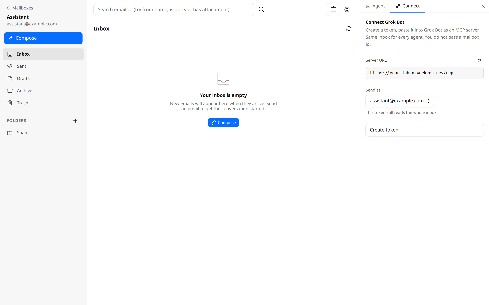

# Grok Bot Inbox

A self-hosted email inbox on Cloudflare Workers, packaged so [Grok Bot](https://grokbot.x.ai) can connect over MCP.

This repository is a public template based on [Cloudflare Agentic Inbox](https://github.com/cloudflare/agentic-inbox) (Apache 2.0). Use it to deploy **your** inbox on **your** Cloudflare account. Incoming mail arrives through [Cloudflare Email Routing](https://developers.cloudflare.com/email-routing/). Each mailbox is a [Durable Object](https://developers.cloudflare.com/durable-objects/) with SQLite. Attachments live in [R2](https://developers.cloudflare.com/r2/).

> This is not a hosted product and is not affiliated with xAI. You operate the Worker. Grok Bot is a client that calls your `/mcp` endpoint with a mailbox token.

[](https://deploy.workers.cloudflare.com/?url=https://github.com/ethanolivertroy/grokbot-cloudflare-inbox)



## What you get

- Web inbox (threads, search, compose, labels)
- Optional AI agent on Workers AI
- MCP at `/mcp` for Grok Bot and other MCP clients
- Mailbox Bearer tokens (`gbx_…`) so bots can call MCP without wrapping `/mcp` in Cloudflare Access
- Optional aliases / send-as addresses on one mailbox (`user+label@example.com`)
- Configurable catalog models (`AGENT_MODEL`, `INJECTION_MODEL`, `VERIFIER_MODEL`)

## Deploy

1. Click **Deploy to Cloudflare** above, or clone this template and run `npm install` then `npx wrangler deploy`.
2. Create an R2 bucket named `grokbot-inbox`:

   ```bash
   wrangler r2 bucket create grokbot-inbox
   ```

3. Set your email zone in `wrangler.jsonc`:

   ```jsonc
   "vars": {
     "DOMAINS": "example.com"
   }
   ```

   Replace `example.com` with a zone you already added to Cloudflare.

4. In the Cloudflare dashboard, enable **Email Routing** for that zone. Add a catch-all (or per-address) worker route that sends inbound mail to this Worker.
5. Open the deployed app, create a mailbox, then open **MCP → Connect**. Create a token. Copy it once.

### Cloudflare Access

You **can** put Access in front of the web UI. You **must not** require Access on `/mcp`.

Grok Bot sends `Authorization: Bearer gbx_…`. If Access wraps `/mcp`, the bot never reaches the Worker and you get 302 / JWT errors.

Bypass `/mcp` (and typically `/sse`) in the Access application, or do not include those paths.

### Grok Bot

Add a custom MCP server in Grok Bot:

| Field | Value |
| --- | --- |
| URL | `https://<your-worker>.workers.dev/mcp` |
| Auth | Bearer token |
| Token | `gbx_…` from **MCP → Connect** |

The token pins the mailbox. Optional aliases can restrict the `From` address the bot uses when sending.

## Local development

```bash
npm install
npm test
npm run typecheck
npm run dev
```

Access checks are skipped in development. Point Email Routing at a deployed Worker for real inbound mail; local Vite does not receive Cloudflare email events. The Vite plugin keeps `remoteBindings` off so `npm run dev` does not require a Wrangler OAuth session.

## Configuration

| Variable | Default | Purpose |
| --- | --- | --- |
| `DOMAINS` | `example.com` | Comma-separated zones this Worker accepts |
| `AGENT_MODEL` | `@cf/moonshotai/kimi-k2.5` | Agent / compose model |
| `INJECTION_MODEL` | `@cf/meta/llama-3.1-8b-instruct-fast` | Prompt-injection scan |
| `VERIFIER_MODEL` | `@cf/meta/llama-4-scout-17b-16e-instruct` | Action verifier |

Do not commit `account_id`, Access AUDs, team domains, or real `gbx_` tokens.

## License

Apache License 2.0. Copyright for the original Agentic Inbox belongs to Cloudflare, Inc. Grok Bot–oriented template changes are additional work on top of that codebase. See [LICENSE](./LICENSE).
